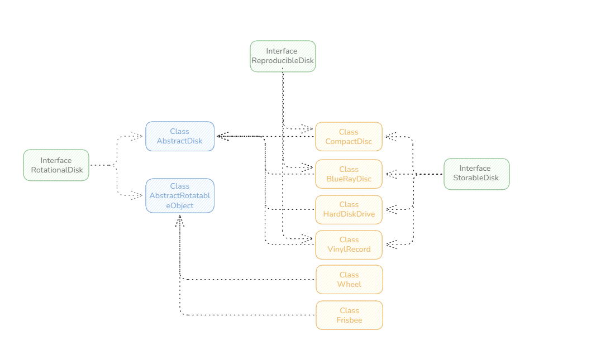
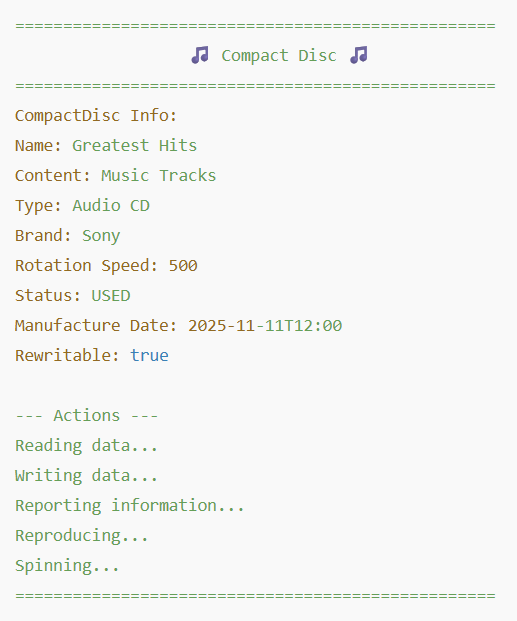

# 480 Technical Test - Java Project

## 🎯 Project Overview

This project is a technical test for 480, implemented in **Java**.
It demonstrates the creation of different rotatable objects and storage media (CD, Blu-ray, Hard Disk Drive, Vinyl LP, Frisbee, Wheel) using object-oriented programming concepts such as:

- Inheritance (abstract classes)

- Interfaces

- Enums

- Polymorphism

- Encapsulation

The project includes a Main class to instantiate objects, set attributes, and execute their behaviors, displaying output in a friendly and readable console format.

## 📦 Project Structure

  

## 🛠 Features Implemented

- **Attributes**: name, content, type, brand, rotation speed, status, manufacture date, rewritable

- **Behaviors**: spin, readData, writeData, reportInformation, reproduce

- **Enum**: Status (NEW, USED, DAMAGED)

- **Console Output**: Friendly, structured, with emojis and separators for readability

## 🚀 How to Run

1) Open the project in your favorite IDE (IntelliJ, Eclipse, etc.)

2) Make sure all classes are in the Proyecto package

3) Run the **Main class**

4) Observe the console output demonstrating each object's attributes and behaviors

## 📌 Example Output

  

## 🙏 Thank You

I would like to sincerely thank **480** for giving me the opportunity to complete this technical test.
It was a great chance to demonstrate my skills in Java, object-oriented programming, and software design.
I appreciate the time taken to review this project and I hope it clearly shows my attention to structure, readability, and functionality.
